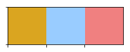
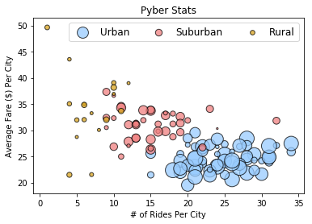
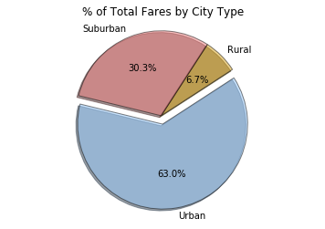
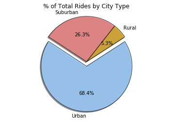
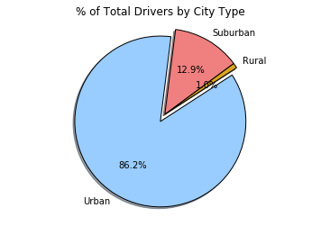

```python
import os
import csv
import pandas as pd
import numpy as np 
import matplotlib.pyplot as plt
import seaborn as sns
```


```python
filepath1 = os.path.join('resources', 'pyber_raw_data','city_data.csv')
filepath2 = os.path.join('resources', 'pyber_raw_data', 'ride_data.csv')
city_df = pd.read_csv(filepath1)
ride_df = pd.read_csv(filepath2)
city_df = city_df.drop_duplicates('city', keep = 'first')
merge_df = pd.merge(city_df,ride_df, how='outer', on='city')

```


```python
city_df.head()
```


<div>
<style>
    .dataframe thead tr:only-child th {
        text-align: right;
    }

    .dataframe thead th {
        text-align: left;
    }

    .dataframe tbody tr th {
        vertical-align: top;
    }
</style>
<table border="1" class="dataframe">
  <thead>
    <tr style="text-align: right;">
      <th></th>
      <th>city</th>
      <th>driver_count</th>
      <th>type</th>
    </tr>
  </thead>
  <tbody>
    <tr>
      <th>0</th>
      <td>Kelseyland</td>
      <td>63</td>
      <td>Urban</td>
    </tr>
    <tr>
      <th>1</th>
      <td>Nguyenbury</td>
      <td>8</td>
      <td>Urban</td>
    </tr>
    <tr>
      <th>2</th>
      <td>East Douglas</td>
      <td>12</td>
      <td>Urban</td>
    </tr>
    <tr>
      <th>3</th>
      <td>West Dawnfurt</td>
      <td>34</td>
      <td>Urban</td>
    </tr>
    <tr>
      <th>4</th>
      <td>Rodriguezburgh</td>
      <td>52</td>
      <td>Urban</td>
    </tr>
  </tbody>
</table>
</div>


```python

merge_df.head()
```


<div>
<style>
    .dataframe thead tr:only-child th {
        text-align: right;
    }

    .dataframe thead th {
        text-align: left;
    }

    .dataframe tbody tr th {
        vertical-align: top;
    }
</style>
<table border="1" class="dataframe">
  <thead>
    <tr style="text-align: right;">
      <th></th>
      <th>city</th>
      <th>driver_count</th>
      <th>type</th>
      <th>date</th>
      <th>fare</th>
      <th>ride_id</th>
    </tr>
  </thead>
  <tbody>
    <tr>
      <th>0</th>
      <td>Kelseyland</td>
      <td>63</td>
      <td>Urban</td>
      <td>2016-08-19 04:27:52</td>
      <td>5.51</td>
      <td>6246006544795</td>
    </tr>
    <tr>
      <th>1</th>
      <td>Kelseyland</td>
      <td>63</td>
      <td>Urban</td>
      <td>2016-04-17 06:59:50</td>
      <td>5.54</td>
      <td>7466473222333</td>
    </tr>
    <tr>
      <th>2</th>
      <td>Kelseyland</td>
      <td>63</td>
      <td>Urban</td>
      <td>2016-05-04 15:06:07</td>
      <td>30.54</td>
      <td>2140501382736</td>
    </tr>
    <tr>
      <th>3</th>
      <td>Kelseyland</td>
      <td>63</td>
      <td>Urban</td>
      <td>2016-01-25 20:44:56</td>
      <td>12.08</td>
      <td>1896987891309</td>
    </tr>
    <tr>
      <th>4</th>
      <td>Kelseyland</td>
      <td>63</td>
      <td>Urban</td>
      <td>2016-08-09 18:19:47</td>
      <td>17.91</td>
      <td>8784212854829</td>
    </tr>
  </tbody>
</table>
</div>


```python
#COLOR SCHEME GOLD, LIGHT SKY BLUE, AND LIGHT CORAL
colors = {'Gold':'#DAA520', 'Light Sky Blue':'#99CCFF','Light Coral':'#F08080'}
sns.palplot(sns.color_palette(colors.values()))
plt.show()
```





```python
cgrp = merge_df.groupby('city')
#Average Fare ($) Per City
avg_fr_cty = citygroup.mean()['fare']
#Total Number of Rides Per City
rides = cgrp['ride_id'].count()
#Total Number of Drivers Per City
drivers = cgrp.mean()['driver_count']
#City Type (Urban, Suburban, Rural)
ctype = city_df.set_index('city')['type']
```


```python
stats = pd.DataFrame({'# of Rides': rides, 'Average Fare': avg_fr_cty, '# of Drivers': drivers, 'Type of City': ctype})
```


```python
#Light Blue
urb = stats[stats['Type of City'] == 'Urban']
#light Coral
sub = stats[stats['Type of City'] == 'Suburban']
#Gold
rur = stats[stats['Type of City'] == 'Rural']

ccolor = {'Urban': colors['Light Sky Blue'], 'Suburban': colors['Light Coral'], 'Rural': colors['Gold']}

a = plt.scatter(urb['# of Rides'], urb['Average Fare'], s = urb['# of Drivers']*5, color = ccolor['Urban'], edgecolor = 'black', label = 'Urban', alpha = .75)
b = plt.scatter(sub['# of Rides'], sub['Average Fare'], s = sub['# of Drivers']*5, color = ccolor['Suburban'], edgecolor = 'black', label = 'Suburban', alpha = .75)
c = plt.scatter(rur['# of Rides'], rur['Average Fare'], s = rur['# of Drivers']*5, color = ccolor['Rural'], edgecolor = 'black', label = 'Rural', alpha = .75)


```


```python
plt.title('Pyber Stats')
plt.xlabel('# of Rides Per City')
plt.ylabel('Average Fare ($) Per City')

plt.legend((a, b, c), ('Urban', 'Suburban', 'Rural'), scatterpoints=1,
            loc='upper right',
            ncol=4,
            fontsize=12)
plt.show()


```





```python

#group by type
by_type = merge_df.groupby('type')['type', 'fare', 'ride_id', 'driver_count']

#total fare by city
fare_sum = by_type.sum()['fare']

#labels
labels = fare_sum.index

#pie colors
piecolors = [ccolor[n] for n in labels]
explode = [0 , 0, .1]
plt.pie(fare_sum, colors = piecolors, explode = explode, labels = labels, autopct = "%1.1f%%", startangle = 33, shadow = True, wedgeprops = {'linewidth': 1, 'edgecolor': 'black', 'alpha': .5})

plt.title('% of Total Fares by City Type')
plt.axis('equal')
plt.show()
```





```python
# number of ride per city type
ride_sum = by_type.count()['ride_id']

labels = ride_sum.index
plt.pie(ride_sum, explode = explode, colors = piecolors, labels = labels, autopct = "%1.1f%%", startangle = 33, shadow = True, wedgeprops = {'linewidth': 1, 'edgecolor': 'black', 'alpha': .75})
plt.title('% of Total Rides by City Type')
plt.axis('equal')
plt.show()
```





```python
driver_sum = by_type.sum()['driver_count']

labels = driver_sum.index
plt.pie(driver_sum, explode = explode, colors = piecolors, labels = labels, autopct = "%1.1f%%", startangle = 33, shadow = True, wedgeprops = {'linewidth': 1, 'edgecolor': 'black', 'alpha': 1})
plt.title('% of Total Drivers by City Type')
plt.axis('equal')
plt.show()
```




